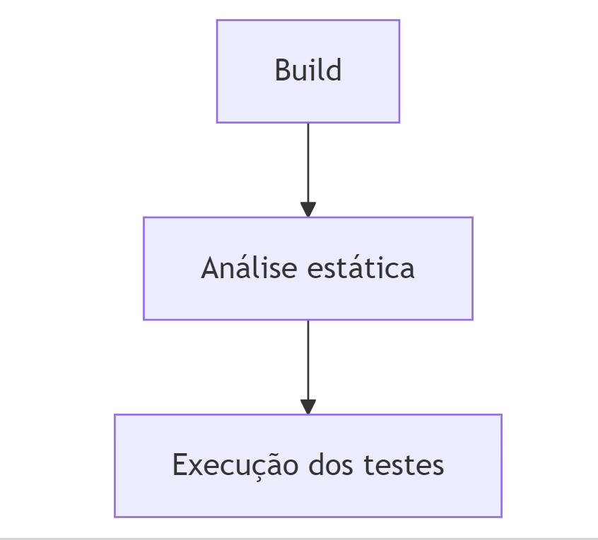

# ESCD11 - Trabalho final

## Executando a aplicação em modo desenvolvimento

```shell script
./mvnw compile quarkus:dev
```

## Uso de versionamento

Usamos o Git Bash ou a UI do GitHub para criação de branches.

## Fluxo de controle de versão


`main`: A branch principal, que representa o ambiente de produção;

`dev`: A branch de desenvolvimento, que é a origem das tasks de desenvolvimento e o destino final. Após uma determinada quantidade de demandas terem sido desenvolvidas, a branch é mergeada com a branch main;

`tk`: A branch onde o código é desenvolvido pelos desenvolvedores e posteriormente revisado. Após aprovado é mergeado com a branch dev; Ao iniciar uma nova tarefa, o desenvolvedor deve criar uma nova branch tk a partir da develop.

Para editar o diagrama:
```
---
title: Git Flow
---
gitGraph
   commit
   branch dev
   checkout dev
   branch TK1
   checkout TK1
   commit
   commit
   checkout dev
   merge TK1
   branch TK2
   commit
   checkout dev
   branch TK3
   commit
   commit
   checkout TK2
   commit
   checkout dev
   merge TK2
   checkout dev
   merge TK3
   checkout main
   merge dev
```
Site para edição: https://mermaid.live/edit#

## Convenção de commits
Utilizamos os Conventional Commits para manter uma padronização no time.

Referências:
- https://www.conventionalcommits.org/pt-br/v1.0.0/
- https://github.com/iuricode/padroes-de-commits
- https://medium.com/linkapi-solutions/conventional-commits-pattern-3778d1a1e657

O padrão que seguimos pode ser visto nos exemplos abaixo:
```
build: create project
feat: implement product registration flow
fix: remove wrong method
```

# Pipeline

## Descrição do pipeline
Nosso processo de pipeline visa garantir a qualidade da entrega de cada TK, executando o build da aplicação, executando testes e realizando uma análise estática do código. Utilizamos o Github Actions para automatizar o processo.

Nosso processo pode ser visto em: .github/workflows/github-actions-demo.yml

## Diagrama das fases do pipeline


Para editar o diagrama
```
flowchart TD
    A[Build] --> B[Análise estática] --> C[Execução dos testes]
```
Site para edição: https://mermaid.live/edit#

## Modo de execução do pipeline
O processo de pipeline é executado a cada commit. Optamos por não restringir a branches principais já que é importante para o desenvolvedor ver se sua entrega está correta antes de entregá-la.

## Etapa de build
A etapa de build realiza a compilação da aplicação. Para isso, utilizamos a JDK (Java) na versão 21 e o Maven com o comando `mvn -B clean compile`.

## Análise estática
Para análise estática utilizamos o action-checkstyle, a documentação pode ser vista em: https://github.com/marketplace/actions/checkstyle-for-java
São verificadas questões como espaçamento, identação, nomenclaturas, etc.

## Testes automatizados
Os testes unitários da aplicação são executados utilizando o próprio Maven, com o comando `mvn test`.